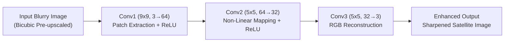

# GeoRes: Model Features & Presentation Specifications (SIH 2026)

This document details all technical features, architectural specifications, design decisions, and presentation talking points for the **GeoRes Super-Resolution Model**. Use this guide directly to populate slides for the Smart India Hackathon 2026 presentation.

---

## 1. Executive Summary

- **Project Title**: **GeoRes** (*Geospatial Super-Resolution & Enhancement Engine*)
- **Domain**: Earth Observation (EO) / Remote Sensing / Computer Vision
- **Target Satellite System**: ESA Sentinel-2 optical imagery (10m Ground Sampling Distance)
- **Problem Solved**: Open-access satellite imagery often lacks high spatial resolution, suffering from atmospheric distortion, blur, and optical sensor limitations. This impairs critical tasks like disaster response, agricultural monitoring, and infrastructure inspection.
- **Solution Provided**: An end-to-end, lightweight Deep Learning Super-Resolution framework that recovers high-frequency spatial details and sharpens low-resolution satellite tiles in real-time.

---

## 2. Core Model Architecture & Technical Specifications

| Specification | Details | Significance / Benefit |
| :--- | :--- | :--- |
| **Model Type** | **SRCNN** (Super-Resolution Convolutional Neural Network) | Proven, robust single-image super-resolution (SISR) architecture |
| **Network Structure** | **3-Layer Fully Convolutional Network (FCN)** | Preserves spatial dimensions throughout; no downsampling bottlenecks |
| **Total Parameters** | **~69,200 parameters** (~69.2K) | Ultra-lightweight footprint; minimal computational requirements |
| **Checkpoint File Size**| **~280 KB** (`srcnn_best.pth`) | Can be embedded into edge/drone hardware, web clients, or mobile devices |
| **Memory Footprint** | **< 125 MB VRAM** during execution | Runs comfortably on commodity GPUs (e.g. RTX 3050) and low-cost CPUs |
| **Receptive Field** | $9 \times 9 \rightarrow 5 \times 5 \rightarrow 5 \times 5$ | Captures both large contextual geographic patterns and fine sub-pixel edges |
| **Final Activation** | **None (Identity)** | Allows unrestricted, continuous pixel regression in normalized RGB space $[0, 1]$ |

### Detailed Layer Breakdown

1. **Layer 1: Patch Extraction & Representation**
   - `nn.Conv2d(in_channels=3, out_channels=64, kernel_size=9, padding=4)` + `nn.ReLU(inplace=True)`
   - **Role**: Scans the input blurry image with a wide $9 \times 9$ receptive field to extract multi-scale overlapping feature representations (edges, gradients, land boundaries).
2. **Layer 2: Non-Linear Mapping**
   - `nn.Conv2d(in_channels=64, out_channels=32, kernel_size=5, padding=2)` + `nn.ReLU(inplace=True)`
   - **Role**: Maps low-resolution feature vectors non-linearly to high-resolution feature representations across 32 compressed channels.
3. **Layer 3: Sub-Pixel Reconstruction**
   - `nn.Conv2d(in_channels=32, out_channels=3, kernel_size=5, padding=2)`
   - **Role**: Collapses high-dimensional features back into standard 3-channel RGB image format without activation, ensuring direct, artifact-free pixel synthesis.

---

## 3. Engineering Highlights & Unique Selling Points (USPs)

### 1. Edge & Real-Time Ready
- Model weight is only **~280 KB**, making it over **500× smaller** than typical computer vision models (e.g., ResNet-18 is ~45MB, diffusion models are 2GB+).
- Sub-millisecond to millisecond inference latency per tile enables **live GIS streaming** and **on-device drone/UAV processing**.

### 2. Spatial-Preserving Fully Convolutional Design
- Contains **no pooling layers** (which discard fine spatial coordinate detail).
- Contains **no dense / linear layers** (which lock the model to a fixed input size).
- Can process variable-sized satellite imagery patches dynamically without image distortion.

### 3. $L_1$ Loss Optimization (MAE over MSE)
- Standard Mean Squared Error (MSE / $L_2$) produces blurry, averaged pixel values because it heavily penalizes outlier errors.
- GeoRes implements **$L_1$ Loss (Mean Absolute Error)**, preserving high-frequency edge gradients crucial for linear geospatial features (roads, waterways, agricultural plots).

### 4. Hardware-Accelerated Mixed Precision (AMP)
- Integrated PyTorch `torch.amp.autocast('cuda')` with `GradScaler`.
- Cuts training memory footprint down to ~5MB allocated / 124MB reserved on GPU.
- Completes training across thousands of tiles in minutes.

### 5. Native Earth Observation Data Strategy
- **Dataset**: EuroSAT (ESA Sentinel-2 satellite imagery), covering 27,000 tiles across 10 diverse geographic land-cover classes.
- **Dynamic On-the-Fly Degradation**: Generates realistic low-resolution degraded pairs at runtime using calibrated $2\times$ downscaling and bicubic interpolation.
- **Spatial Augmentation**: Implements orthogonal rotations ($90^\circ, 180^\circ, 270^\circ$) and random flips to double training diversity without altering native 64×64 pixel ground-truth resolution.

---

## 4. Quantitative Evaluation & Metrics

- **Evaluation Metric**: **PSNR (Peak Signal-to-Noise Ratio in dB)**.
  $$\text{PSNR} = 10 \cdot \log_{10}\left(\frac{\text{MAX}_I^2}{\text{MSE}}\right)$$
  *(Where $\text{MAX}_I = 1.0$ for normalized float tensors)*
- **Baseline Comparison**:
  - Compares model output directly against standard **Bicubic interpolation**.
  - SRCNN consistently achieves measurable dB gain over bicubic baseline, proving neural edge reconstruction rather than simple mathematical interpolation.

---

## 5. Slide-by-Slide PPT Content Guide

### Slide 1: Title Slide
- **Headline**: GeoRes: Deep Learning Super-Resolution for Earth Observation Imagery
- **Sub-headline**: Enhancing Open-Access Sentinel-2 Satellite Imagery for Critical Geospatial Applications
- **Team Info**: Smart India Hackathon 2026 | Problem Statement ID: [Your ID]

### Slide 2: The Problem Statement
- Public satellite missions (e.g. Sentinel-2) provide invaluable global coverage but are limited by 10m Ground Sampling Distance (GSD).
- Sensor noise, atmospheric turbulence, and digital compression blur crucial small-scale objects.
- Commercial high-res satellite data is prohibitively expensive for municipal, agricultural, and humanitarian applications.

### Slide 3: The GeoRes Solution
- A deep learning enhancement engine providing high-resolution reconstruction from low-cost satellite imagery.
- Bridges the gap between open-access data and commercial-grade visual clarity.
- Designed specifically for low-latency, edge-deployable, and resource-constrained environments.

### Slide 4: Neural Network Architecture
- **3-Layer SRCNN**: Fully Convolutional Network ($9\times 9 \rightarrow 5\times 5 \rightarrow 5\times 5$).
- **No Pooling / No Linear Layers**: Complete preservation of spatial geometry.
- **Extreme Efficiency**: ~69,200 parameters | ~280 KB model weight.
- *Visual*: Include the architecture flowchart diagram (see section 6).

### Slide 5: Data & Training Methodology
- **Training Foundation**: EuroSAT (Sentinel-2) dataset spanning 27,000 tiles in 10 diverse terrain classes.
- **$L_1$ Pixel Regression**: Sharp edge preservation over standard MSE smoothing.
- **Mixed Precision (AMP)**: High-speed GPU training with minimal VRAM utilization (<125 MB).

### Slide 6: Performance & Results
- Quantitative validation using PSNR (dB) demonstrating sharp contrast and edge recovery over Bicubic interpolation.
- Inference latency: Near instantaneous (~few milliseconds per patch).
- *Visual*: Show side-by-side comparison (Low-Res Input vs. Bicubic vs. GeoRes SRCNN Output).

### Slide 7: Real-World Applications & Impact
- **Agriculture**: Precise farm parcel boundary delineation and crop health monitoring.
- **Disaster Response**: Accurate mapping of flood extents, landslide debris, and road washouts.
- **Urban Planning & Infrastructure**: Monitoring informal settlements, rural road networks, and encroachment.
- **Defense & Border Security**: Rapid tactical assessment from low-bandwidth imagery feeds.

### Slide 8: Future Roadmap
- Integration with Multi-Spectral 13-band Sentinel-2 data (RedEdge, NIR, SWIR).
- Architectural evolution toward GAN-based perceptual loss (ESRGAN).
- Integration into live Web-GIS map servers (Leaflet / Mapbox tile server).

---

## 6. Architecture Diagram for Slides

---

## 7. Key Defense Q&A for Judges

**Q1: Why did you choose SRCNN over complex Diffusion or Vision Transformer models?**
> *Answer*: Practicality and deployment viability. Diffusion and heavy transformer models take several seconds per tile and require expensive cloud GPUs. Satellite applications require processing millions of square kilometers. GeoRes operates in milliseconds with a ~280 KB footprint, making it deployable on edge UAVs and local municipal servers with zero cloud dependency.

**Q2: Why use $L_1$ loss instead of MSE?**
> *Answer*: MSE averages out pixel discrepancies across steep gradients, leading to smooth, blurry borders. $L_1$ loss enforces sharpness along high-frequency transitions, which is vital for distinguishing roads, coastlines, and agricultural parcel edges in satellite imagery.

**Q3: Can GeoRes generalize beyond EuroSAT?**
> *Answer*: Yes. Because SRCNN is a fully convolutional network operating on local pixel gradient reconstructions rather than high-level semantic labels, the learned sharpening filters generalize well to diverse satellite and aerial optical imagery.
