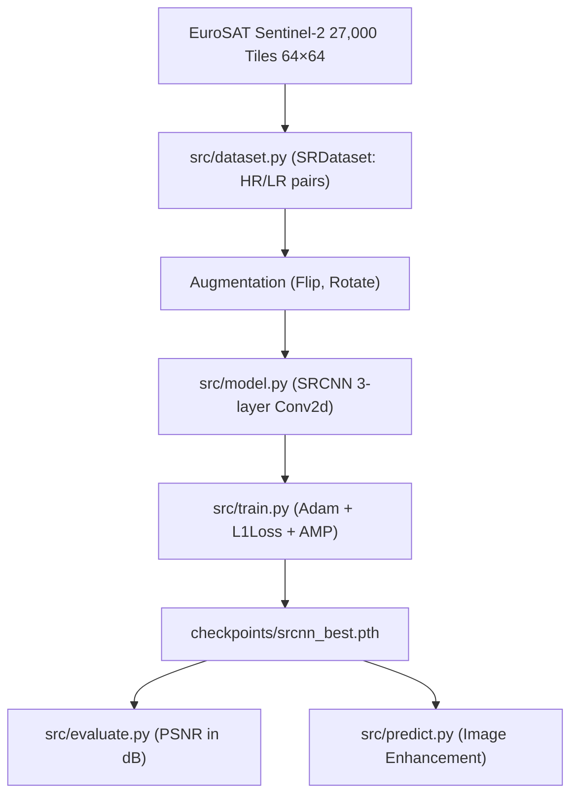

# Architecture

High-level system map: modules, services, data flow. Big picture only, no implementation detail.

## Overview
- **Project**: GeoRes (Smart India Hackathon 2026)
- **Domain**: Geospatial / Earth Observation / Satellite Image Enhancement
- **Core Dataset**: EuroSAT (Sentinel-2 satellite imagery, 27,000 RGB tiles at 64×64)
- **Task**: Single-image super-resolution (SRCNN) — enhance blurry satellite images

## Components
- **Data Ingestion & Preprocessing** (`src/dataset.py`):
  - Ingestion: Reads EuroSAT Sentinel-2 tiles (27,000 images, 64×64 RGB) from `data/eurosat/Dataset`.
  - Pair generation: Each tile serves as the HR target; degraded input synthesized via bicubic downscale+upscale.
  - Augmentation: Random flips and 90° rotations (not spatial crops — tiles are too small).
- **Model Architecture** (`src/model.py`):
  - SRCNN (Dong et al., 2014): 3 Conv2d layers (3→64→32→3), kernel sizes 9/5/5.
  - No pooling, no linear layers — fully convolutional, spatial-preserving.
  - Output: Enhanced RGB image at same spatial size as input.
  - Device: Auto-detected hardware acceleration (CUDA NVIDIA RTX 3050 / CPU).
- **Training Engine** (`src/train.py`):
  - Optimizer: Adam with flat learning rate.
  - Loss: L1Loss (pixel-wise, sharper than MSE for super-resolution).
  - AMP: Mandatory (GradScaler + autocast) for 6GB VRAM constraint.
  - Checkpointing: Best checkpoint by lowest L1 loss to `checkpoints/srcnn_best.pth`.
- **Evaluation** (`src/evaluate.py`):
  - PSNR (Peak Signal-to-Noise Ratio) comparison: SRCNN vs bicubic baseline.
- **Inference** (`src/predict.py`):
  - Single-image enhancement: upscale via bicubic, refine via SRCNN, save as PNG.

## System Map

